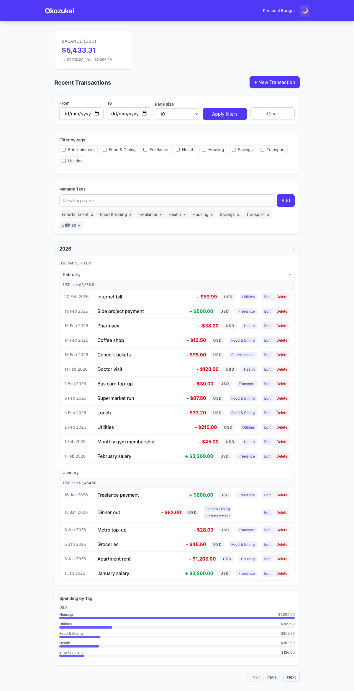
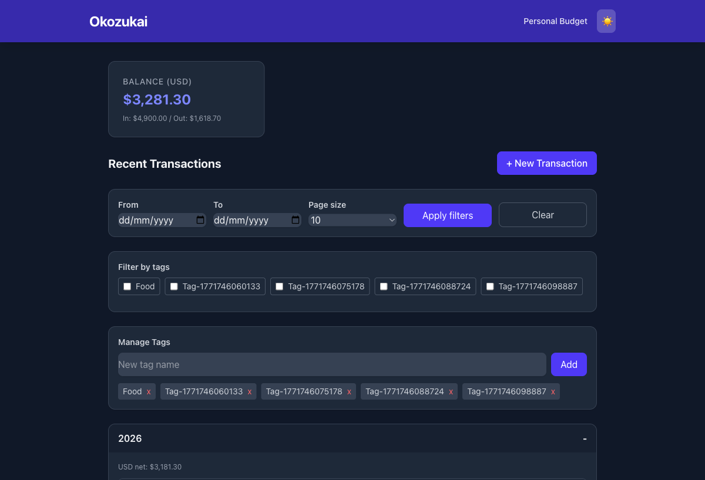
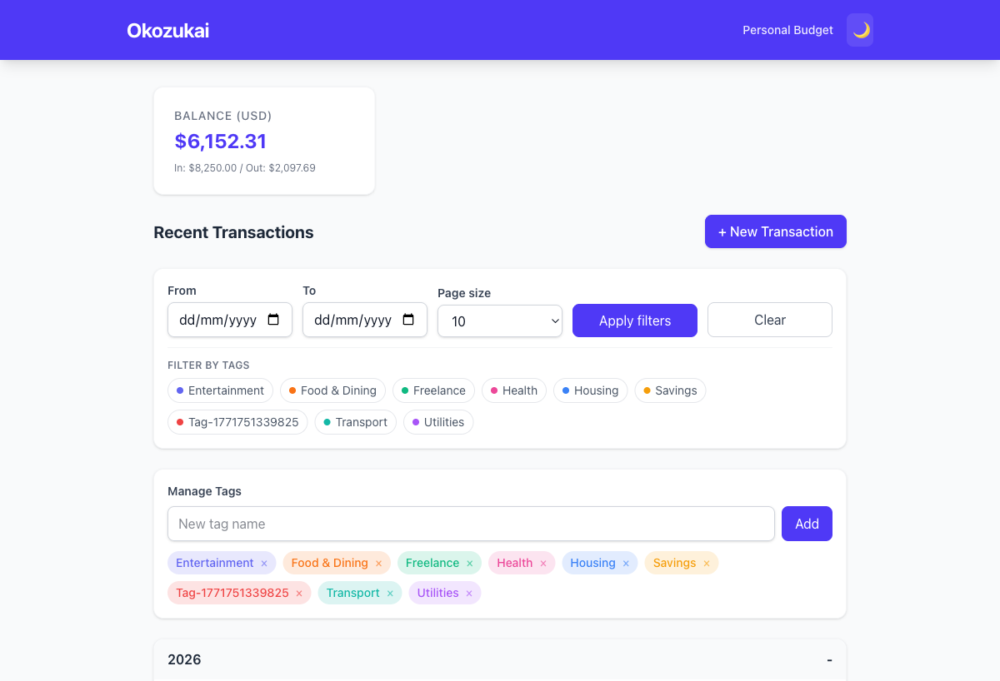

# Okozukai (お小遣い)

A self-hosted personal budget tracker built with a clean-architecture .NET 10 backend and a Vue 3 SPA frontend, orchestrated with .NET Aspire.

## Screenshots

| Light mode | Dark mode |
|---|---|
|  |  |

**Dashboard with charts:**



## Features

- **Journals** – Organize finances into independent budget contexts, each with its own currency
- **Transactions** – Record income and expenses with notes, dates, and tags
- **Tags** – Categorize spending with colour-coded labels and filter/search by tag
- **Spending by tag** – See where money goes with bar charts and doughnut charts
- **Monthly charts** – Income vs expenses, net balance trend, and per-tag monthly breakdown
- **Dashboard customization** – Toggle individual chart panels; preferences are persisted per journal
- **Period grouping** – Transactions grouped by year/month with collapsible rollup summaries
- **CSV export** – Export transactions for a journal to a CSV file
- **Dark mode** – Full dark-mode support across all pages and charts
- **Close/reopen journals** – Archive completed budget periods; closed journals are read-only

## Tech stack

| Layer | Technology |
|---|---|
| Runtime | .NET 10 |
| API | ASP.NET Core Web API |
| ORM | Entity Framework Core + PostgreSQL |
| Orchestration | .NET Aspire |
| Frontend | Vue 3 + TypeScript + Vite |
| Styling | Tailwind CSS v4 |
| Charts | Chart.js via vue-chartjs |
| Tests | xUnit (unit + integration), Vitest, Playwright |

## Architecture

```
src/
  Okozukai.AppHost        # .NET Aspire orchestrator (entry point)
  Okozukai.Api            # ASP.NET Core controllers + global error handler
  Okozukai.Application    # Use-cases, DTOs, repository interfaces
  Okozukai.Domain         # Entities and business rules (no dependencies)
  Okozukai.Infrastructure # EF Core, PostgreSQL, code-first migrations
  Okozukai.Frontend       # Vue 3 SPA
  Okozukai.ServiceDefaults# Shared OpenTelemetry / health-check config
tests/
  Okozukai.UnitTests       # Domain + application unit tests
  Okozukai.IntegrationTests# API integration tests (WebApplicationFactory)
```

## Prerequisites

- [.NET 10 SDK](https://dotnet.microsoft.com/download)
- [Node.js 20+](https://nodejs.org/)
- [Docker Desktop](https://www.docker.com/products/docker-desktop/) (for the PostgreSQL container)

## Getting started

```bash
# 1. Clone the repository
git clone https://github.com/archer0302/Okozukai.git
cd Okozukai

# 2. Provide a PostgreSQL connection string
#    The AppHost reads it from the 'okozukai' connection string.
#    The easiest way during development is user secrets:
dotnet user-secrets set "ConnectionStrings:okozukai" \
  "Host=localhost;Port=5432;Database=okozukai;Username=postgres;Password=yourpassword" \
  --project src/Okozukai.AppHost

# 3. Install frontend dependencies
cd src/Okozukai.Frontend && npm install && cd ../..

# 4. Run the application (starts PostgreSQL container + API + frontend)
aspire run
```

The Aspire dashboard opens automatically. The Vue frontend is available at the URL shown under the `frontend` resource.

> **Note:** The API applies EF Core migrations automatically on startup. No manual `dotnet ef` commands are required.

### Tailscale / Tailnet access (optional)

To expose the app on your Tailnet, set the `TAILNET_IP` environment variable to your machine's Tailscale IP before running:

```bash
export TAILNET_IP=<your-tailscale-ip>  # e.g. 100.x.x.x
aspire run --launch-profile tailnet
```

`TAILNET_API_PORT` (default `5005`) and `TAILNET_FRONTEND_PORT` (default `5173`) can also be overridden the same way.

## Running tests

```bash
# Backend (unit + integration)
dotnet test Okozukai.slnx --no-build -nologo

# Frontend (Vitest component tests)
cd src/Okozukai.Frontend && npm test

# Frontend E2E (Playwright — requires the app to be running)
cd src/Okozukai.Frontend && npm run test:e2e
```

## API overview

| Method | Path | Description |
|---|---|---|
| `GET/POST` | `/api/journals` | List / create journals |
| `GET/PUT/DELETE` | `/api/journals/{id}` | Read / update / delete a journal |
| `POST` | `/api/journals/{id}/close` | Close a journal (makes it read-only) |
| `POST` | `/api/journals/{id}/reopen` | Reopen a closed journal |
| `GET/POST` | `/api/transactions?journalId=` | List / create transactions |
| `PUT/DELETE` | `/api/transactions/{id}?journalId=` | Update / delete a transaction |
| `GET` | `/api/transactions/summary?journalId=` | Balance summary (totalIn, totalOut, net) |
| `GET` | `/api/transactions/grouped?journalId=` | Year/month grouped view with rollups |
| `GET` | `/api/transactions/spending-by-tag?journalId=` | Spending breakdown by tag |
| `GET` | `/api/transactions/export?journalId=` | CSV export |
| `GET/POST` | `/api/tags` | List / create tags |
| `PUT/DELETE` | `/api/tags/{id}` | Update / delete a tag |

All error responses are structured JSON `{ "message": "...", "detail": "..." }`.

## License

This project is licensed under the [MIT License](LICENSE).
